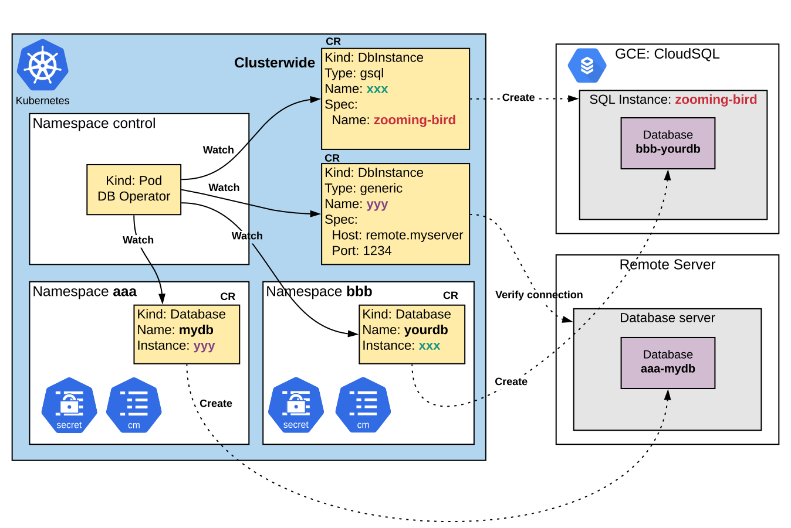

# How DB Operator works

The DB Operator watches `Database` and `DbInstance` [custom resource](https://kubernetes.io/docs/concepts/extend-kubernetes/api-extension/custom-resources/).

## Custom Resource Definitions

* **`DbInstance`:** defines **target database server** located outside/inside Kubernetes where the Operator creates database in. `DbInstance` resource in Kubernetes represents the actual database server. The target server can be changed by modifying the `DbInstance` spec, so the `Database` resource doesn't need to be changed. `Database` uses `DbInstance` to find out the target server where databases must be created.

* **`Database`:** defines a database that must exist in the `DbInstance`. For database creation in a `DbInstance`, the `DbInstance` must firstly have status **true**; The name of the `DbInstance` previously created is referred in the `spec.instance` of `Database` resource.

The DB Operator requires admin user and password of the database server as `Secret` resource to manage databases. The name of the `Secret` must be provided in `spec.adminUserSecret` of `DbInstance` resource.

To create a **google** type `DbInstance`, you need to provide [Google Service account](https://cloud.google.com/iam/docs/service-accounts) with Cloud SQL Admin role to the Operator.
When `DbInstance` is created, the DB Operator creates **[Google Cloud SQL](https://cloud.google.com/sql/docs/features) instances** in GCP. 

Regarding creation of a **generic** type `DbInstance`, this is currently not supported by the Operator. For that, a database server must be up and running. Its `address` and `port` must be provided when setting up a `DbInstance`. The DB Operator will then only verify if the defined server(address:port) is reachable.

When a `Database` resource is created in Kubernetes, the operator creates the actual database in the instance. Afterwards, it creates a `ConfigMap` and a `Secret` containing connection information such as host, user and password for accessing database. So the application `Pods` can use the database by reading the `ConfigMap` and the `Secret` through `envFrom` or `volumeMounts`. 

Please find example usage in [examples/](examples/). (TODO: write kubernetes menifests how to use from app in examples/)

## Workflow details

### Operator
The DB Operator installed via helm runs in a specified namespace by `helm --namespace <your prefered namespace>` as a pod (not necessarily in the control namespace but in any namespace). It watches `Database`, `DbInstance` custom resources in **cluster scope**. 

### DbInstance Google type

* supported engines: postgres, mysql

When a Google type DbInstance is created, the DB Operator acutally creates a Google Cloud SQL instance in GCP. `Spec.Name` will be used as the name of Cloud SQL instance. The Operator uses [Google REST API](https://cloud.google.com/sql/docs/mysql/admin-api/rest/v1beta4/instances#DatabaseInstance) to create actual instance in GCP project. So it requires service account credential with Cloud SQL Admin role. 

### DbInstance Generic type

* supported engines: postgres, mysql

When a Generic type DbInstance is created, the DB Operator doesn't create the actual instance, but instead it only checks if the instance is reachable.

### Database

When `DbInstance` reaches `Running` phase, `Database`(s) resources can be created. `DbInstance` is a cluster scope resource, while `Database` is a namespaced resource. When a `Database` resource is created, the operator will create the actual database in the `DbInstance` which is referred in the `spec.instance`. 

The naming convention for database names is `< namespace >-< name of the Database custom resource >`. Due to [naming restrictions of mysql database](https://dev.mysql.com/doc/refman/5.7/en/identifier-length.html), the name of the database created in the mysql server is md5 hashed. The same behavior does not apply to the other supported database kinds.

Just like shown on the picture above, the `Database` `mydb` is created in the namespace `aaa` and it uses the `DbInstance` `yyy`. The Operator will create database `aaa-mydb` in `yyy` instance which points to the server `remote.myserver`.

Afterwards, the operator creates a `Secret` and a `Configmap` which contains necessary information for connecting to the database such as connection string, generated username and password.